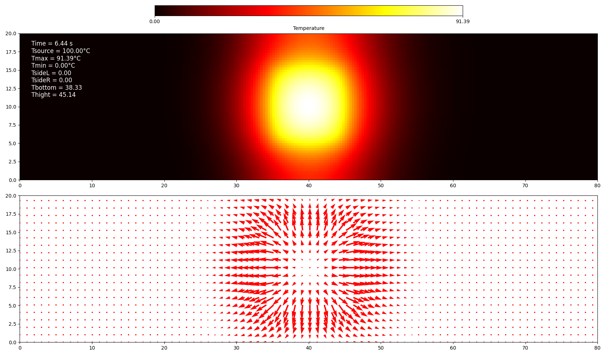
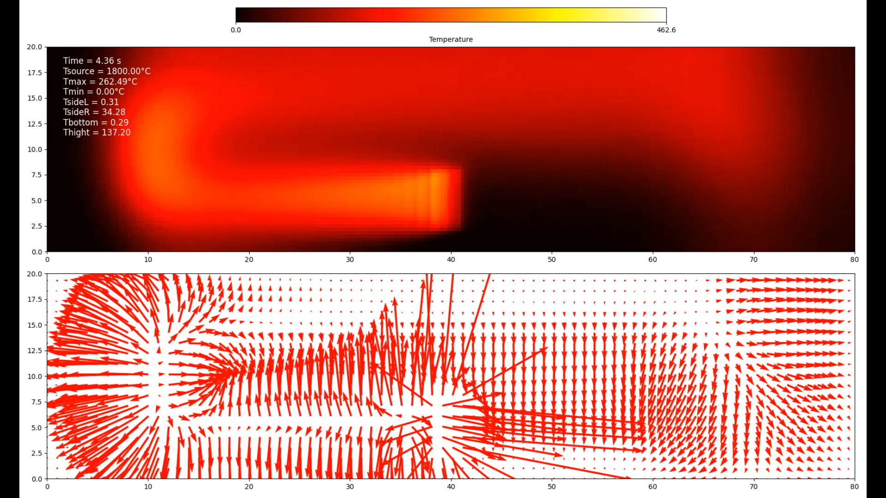

# Temperature-diffusion-with-explicit-Euler-2D

This program simulates the diffusion of temperature in a 2D material with a heat source using explicit Euler approximation.
There is a visualization of the temperature diffusion and a visualization of the temperature gradient.
The program works by plotting a 2D image for every iteration and saving it in a folder. At the end of the program, a video is generated from all the images using os and moviepy.
You need to create a folder and specify the path to this folder at the beginning of the code.

This code is not optimized.

There is a program for simple diffusion of a Gaussian temperature profile

and a program to simulate a blowtorch heating a block of material.

